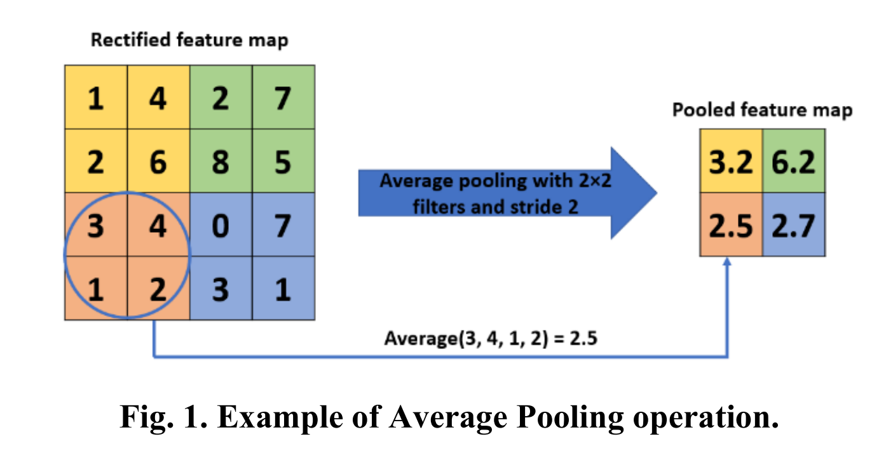
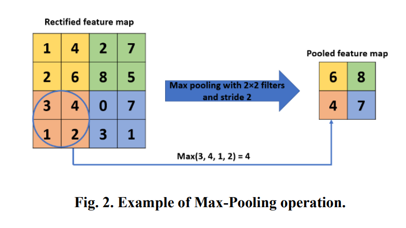
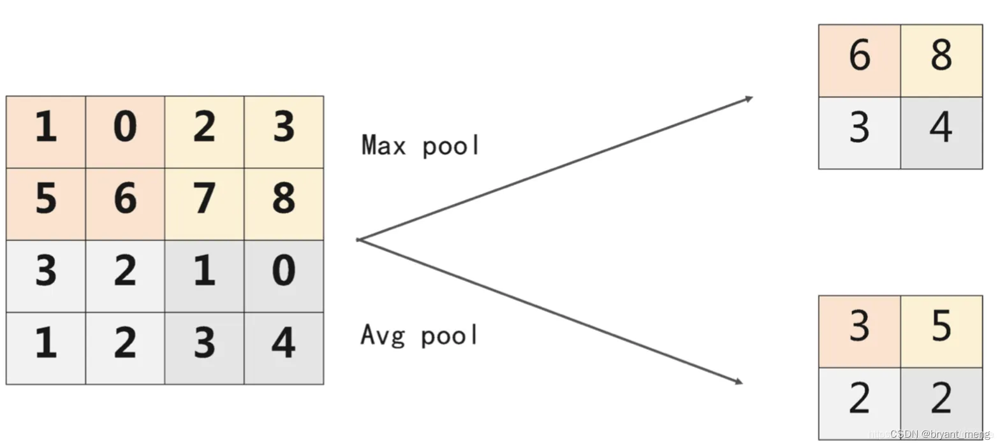
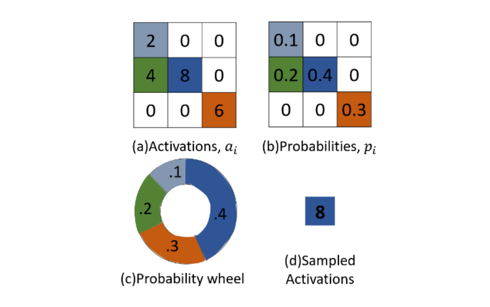
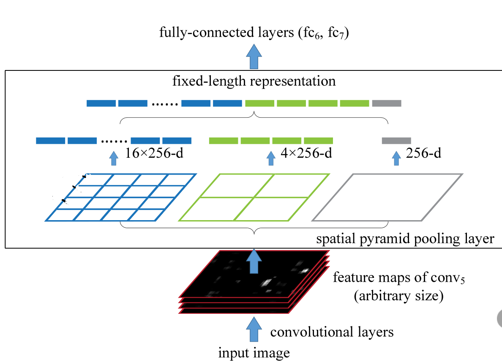

<!--
 * @Descripttion: 
 * @version: 1.0
 * @Author: Areebol
 * @Date: 2023-07-06 20:28:02
-->
# reference
- https://zhuanlan.zhihu.com/p/377572391
- https://zhuanlan.zhihu.com/p/381752896
- https://jishuin.proginn.com/p/763bfbd5c125
- https://blog.csdn.net/qq_38890412/article/details/118341032
- https://medium.com/aiguys/pooling-layers-in-neural-nets-and-their-variants-f6129fc4628b
- https://arxiv.org/ftp/arxiv/papers/2009/2009.07485.pdf

# function of pooling
- 增大网络感受野
- 抑制噪声，降低信息冗余
- 降低模型计算量，降低网络优化难度，防止网络过拟合
- 使模型对输入图像中的特征位置变化更加鲁棒

**main function**
- reduce number of parameters or weights -> extract only useful information
- control the overfitting of the network -> discard irrelevant details

The pooling layer is usually inserted after a convolution layer.The application of this layer is reducing the size of feature maps and network parameters.

# Popular Pooling Methods
## Average Pooling 1
lecun use this pooling tech first

## Max Pooling 1

## Mixed Pooling 1

## Lp Pooling 1
Sermanet et al. [16] proposed the concept of 𝐿𝑃 pooling and claimed that its generalization ability is better than max pooling.

## Stochastic Pooling 1

## Spatial Pyramid Pooling 1

https://www.cnblogs.com/marsggbo/p/8572846.html

## Region of Interest Pooling 1

## gloabl pooling 1

## soft pooling 1
https://arxiv.org/pdf/2101.00440.pdf

## local importance-based pooling 1

## S3 pooling 1
https://arxiv.org/pdf/1611.05138.pdf

## graph pooling 3
图神经网络使用的池化方法

# Novel Pooling Methods

## Multi-scale order-less pooling (MOP) 1
Gong, Y., et al. Multi-scale orderless pooling of deep convolutional activation features. in European conference on 
computer vision. 2014. Springer

## Super-pixel Pooling 1
Ren, X. and J. Malik. Learning a classification model for segmentation. in null. 2003. IEEE.

## Lead Asymmetric Pooling (LAP)

## Per-pixel Pyramid Pooling 1

## Rank-based Average Pooling 1

## Spectral Pooling 1

## Weighted Pooling 1

## Genetic-Based Pooling 1

## Intermap Pooling 1

## Row-Wise Max Pooling 1

## Edge-aware Pyramid Pooling

## PCA Networks

## Compact Bilinear Pooling
